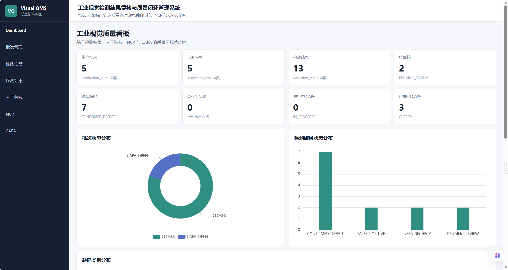
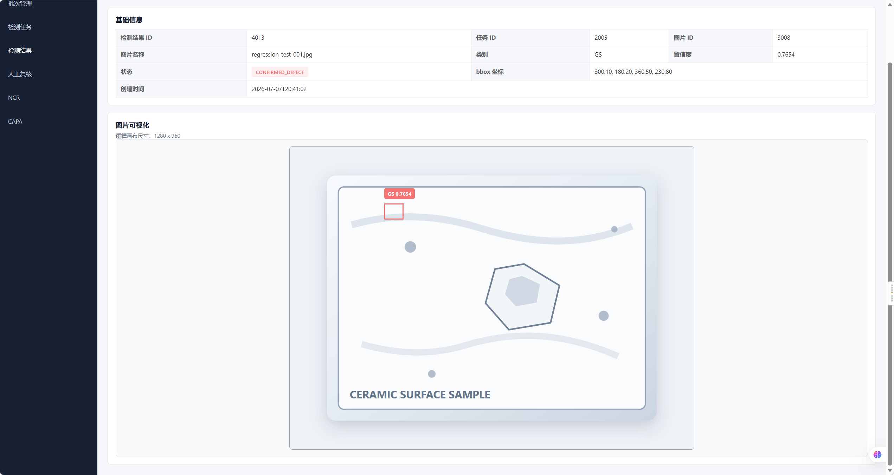

# 工业视觉检测结果复核与质量闭环管理系统

## 项目简介

这是一个面向工业视觉质检场景的 Spring Boot + Vue 3 全栈项目原型，用于展示视觉检测结果进入企业质量管理流程后的复核、追溯和整改闭环。

本项目不是训练 YOLO 模型，也不接入真实产线推理服务，而是模拟 YOLO 检测结果输出后，如何被导入业务系统、由人工复核确认，并进一步形成 NCR 不合格记录和 CAPA 整改闭环。

系统支持检测结果导入、人工复核、NCR 不合格记录、CAPA 整改闭环、Dashboard 质量看板，以及检测结果 bbox 可视化详情页，适合作为工业视觉质检方向的学习、作品集展示和面试讲解项目。

## 项目截图

### Dashboard 质量看板



### 检测结果 bbox 可视化详情页



## 核心业务流程

```text
生产批次
→ 检测任务
→ YOLO JSON 导入
→ 检测结果
→ 人工复核
→ NCR 不合格记录
→ CAPA 整改闭环
```

## 功能模块

### 后端

- 批次管理：创建、分页查询、详情、基础信息更新、状态更新。
- 检测任务管理：创建任务、分页查询、详情、按批次查询、状态更新。
- YOLO JSON 导入：解析模型输出 JSON，写入检测图片和检测结果。
- 检测结果查询：按任务、图片、类别、复核状态查询检测结果。
- 人工复核：对检测结果确认缺陷、标记误检或要求复检。
- NCR：基于确认缺陷的复核记录创建不合格记录，并更新批次状态。
- CAPA：基于 OPEN NCR 创建整改闭环，支持更新、验证、关闭和同步关闭批次。
- Dashboard 统计接口：统计批次、任务、检测结果、待复核、NCR、CAPA 等质量指标。
- 检测结果可视化详情接口：联合检测结果和检测图片信息，返回 bbox 可视化详情数据。

### 前端

- Dashboard 质量看板：统计卡片、状态分布图、待处理提示。
- 批次管理：批次列表、筛选、详情和批次下检测任务查看。
- 检测任务：任务列表、筛选、跳转检测结果。
- 检测结果列表：查看类别、置信度、bbox 坐标和复核状态。
- 检测结果 bbox 可视化详情页：在样例图片上叠加 bbox 框，展示类别、置信度和状态。
- 人工复核：从检测结果列表或详情页发起复核。
- NCR：查看不合格记录，并从 OPEN NCR 创建 CAPA。
- CAPA：查看、编辑、验证和关闭整改闭环。

## 技术栈

后端：

- Java 21
- Spring Boot 3
- MyBatis-Plus
- MySQL 8
- Knife4j / Swagger
- Maven

前端：

- Vue 3
- Vite
- Element Plus
- Axios
- Vue Router
- ECharts

## 项目亮点

- 不是简单 CRUD，而是围绕工业视觉质检后的质量闭环设计。
- 支持 YOLO JSON 到业务检测记录的转换，保留类别、置信度、bbox 和原始 payload。
- 将模型检测结果和人工复核结论分离，避免模型误检直接进入质量流程。
- 支持 NCR / CAPA 跨表状态流转，覆盖确认缺陷、不合格记录、整改、验证和关闭。
- 使用事务保证创建 NCR、创建 CAPA、关闭 CAPA 时的数据一致性。
- Dashboard 展示批次、检测结果、待复核、NCR、CAPA 等质量状态指标。
- 检测结果详情页支持样例图片 bbox 可视化，并提供人工复核入口。

## 快速启动

## 使用 Docker Compose 启动 MySQL

如果本机没有安装 MySQL，或希望快速准备一套隔离的演示数据库，可以在项目根目录使用 Docker Compose 启动 MySQL 8。

启动数据库：

```bat
docker compose up -d
```

查看容器状态：

```bat
docker ps
```

Docker MySQL 默认连接信息：

```text
host: localhost
port: 3306
database: visual_qms
username: root
password: visual_qms_password
```

使用 Docker MySQL 启动后端：

```bat
cd /d D:\Project_Portfolio\visual-quality-flow-system\backend
set MYSQL_PASSWORD=visual_qms_password
mvn spring-boot:run -Dspring-boot.run.arguments=--server.port=8081
```

停止数据库：

```bat
docker compose down
```

`docker compose down` 不会删除 named volume 中的 MySQL 数据。下次重新 `docker compose up -d` 时会继续使用已有数据。

如果需要清空 Docker 数据卷并重新执行初始化 SQL：

```bat
docker compose down -v
docker compose up -d
```

`docker compose down -v` 会删除数据库数据，请只在需要重置演示环境时使用。本地开发也可以继续使用自己安装的 MySQL，只要后端启动时的 `MYSQL_PASSWORD` 与本地 MySQL 密码对应即可。

### 后端启动

进入后端目录，并通过环境变量传入本地 MySQL 密码：

```bat
cd /d D:\Project_Portfolio\visual-quality-flow-system\backend
set MYSQL_PASSWORD=your_mysql_password
mvn spring-boot:run -Dspring-boot.run.arguments=--server.port=8081
```

说明：真实项目中数据库密码不应写入配置文件或提交到代码仓库。本项目的 `application.yml` 使用 `MYSQL_USERNAME` / `MYSQL_PASSWORD` 环境变量读取数据库账号密码。

### 前端启动

进入前端目录，安装依赖并启动 Vite：

```bat
cd /d D:\Project_Portfolio\visual-quality-flow-system\frontend
npm.cmd install
npm.cmd run dev
```

### 访问地址

- 前端：`http://localhost:5173`
- Knife4j：`http://localhost:8081/doc.html`

前端通过 Vite 代理访问后端：

```text
/api -> http://localhost:8081
```

## 数据库初始化

数据库建议使用 MySQL 8。初始化文件位于 `sample-data` 目录：

- `sample-data/init_schema.sql`：创建核心业务表结构。
- `sample-data/sample_seed_data.sql`：写入脱敏演示数据。
- `sample-data/sample_yolo_detection.json`：YOLO JSON 导入接口的示例数据。

推荐执行顺序：

```sql
CREATE DATABASE IF NOT EXISTS visual_qms DEFAULT CHARACTER SET utf8mb4 COLLATE utf8mb4_0900_ai_ci;
USE visual_qms;
SOURCE sample-data/init_schema.sql;
SOURCE sample-data/sample_seed_data.sql;
```

如果使用 MySQL Workbench，也可以手动打开 SQL 文件后依次执行。

## 页面地址

| 页面 | 地址 | 说明 |
| --- | --- | --- |
| Dashboard | `http://localhost:5173/` | 展示质量统计看板 |
| 批次管理 | `http://localhost:5173/batches` | 查询批次与质量状态 |
| 批次详情 | `http://localhost:5173/batches/{id}` | 查看批次详情和该批次下检测任务 |
| 检测任务 | `http://localhost:5173/inspection-tasks` | 查询检测任务 |
| 检测结果 | `http://localhost:5173/detections` | 查询检测框和复核状态 |
| 检测结果详情 | `http://localhost:5173/detections/{id}` | 查看样例图片上的 bbox 可视化，并可发起人工复核 |
| 人工复核 | `http://localhost:5173/reviews` | 查看复核记录，可创建 NCR |
| NCR | `http://localhost:5173/ncrs` | 查询 NCR，可创建 CAPA |
| CAPA | `http://localhost:5173/capas` | 查询、编辑和关闭 CAPA |

## 非目标说明

- 本项目不是完整 MES / QMS 系统。
- 本项目不包含真实企业数据。
- 本项目不接入真实工业相机、产线设备或现场控制系统。
- 本项目不做在线模型推理，也不训练 YOLO 模型。
- 本项目是用于学习、作品集展示和面试讲解的原型系统，不应被理解为真实企业上线系统。
